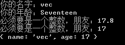
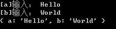

# 安装

```
npm install collect-info
```

# 介是啥么包？

以 Schema 的方式在命令行中获取用户输入。

```javascript
const Collect = require('collect-info');

const Form = new Collect([
	{
		name: 'name',
		prompt: '你的名字：',
		type: String,
	},
	{
		name: 'age',
		prompt: '你的年龄：',
		type: Number.isInteger,
		catch: '必须要是一个整数，朋友：'
	}
]);

Form.start()
	.then(obj => {
		console.log(obj);
	})

```

运行结果：



# 使用其它流作为输入

`collect-info` 默认以 `process.stdin` 获取输入，你也可以自定义一个流作为输入。

input.txt:
```
Hello
World
```

run.js:
```javascript
const Collect = require('collect-info')

const Schema = [{ name: 'a' }, { name: 'b' }]

const Form = new Collect(Schema)

const stream = require('fs').createReadStream('input.txt')

Form.start(stream).then(obj => console.log(obj))
```

运行结果：




# 覆盖率测试

```
node node_modules\istanbul\lib\cli.js cover node_modules\mocha\bin\_mocha
```

# License

MIT
